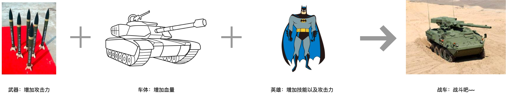

# bitchariot
bitchariot是一个专注于游戏NFT资产的团队。

## 项目愿景
游戏NFT的冷启动，NFT发行，以及NFT合成资产的探索；

## 项目介绍
bitchariot是一个集NFT发行，以及NFT合成资产的产品，用户可以在bitchariot通过质押流动性获取NFT零件，比如武器、英雄、车体等等，同样也可以通过代币进行直接购买。
同时bitchariot中零件是毫无用处的，必须合成战车NFT，合成以后才可以参加战斗，赢取更多奖励。随后bitchariot会增加NFT玩法，通过代币激励、NFT交易等等激活整个bitchariot生态。

### NFT创币
在bitchariot中，NFT的发行有两种方式：
- 流动性质押

质押代币的流动性到矿池，根据质押时间和质押数量获得算力，达到要求后，可以收获一枚NFT零件。是通过流动性换取资产的途径。

- 代币购买

通过支付代币向矿池直接购买零件NFT，通过资产置换来获得NFT的途径。

### 合成资产
对于合成NFT的获取只能通过其他NFT合成，无法通过质押流动性或者代币进行购买。

通过3个NFT合成一个新的NFT。单一类型的NFT，只有微弱价值，仍然具有流动性，但新的合成NFT资产会极大提升价值，同时可以应用在新的场景。
原有NFT无法流动，合并到新的NFT。

### NFT属性
NFT符合`ERC721`标准，同时NFT有自己的DNA来标记零件或者合成NFT的属性。比如武器的攻击力、车体的血量等等；

### 更多探索
- 增加NFT品类和零件；
- 加入游戏PVP对战，增加NFT的耐久属性，通过对战获取平台代币，用于NFT购买等等；

## 项目结构
```bash
.
├── README.md
├── contracts // 合约代码
└── frontend // 前端代码

```
